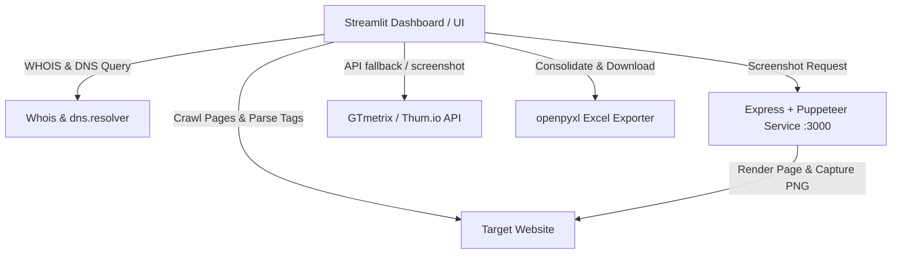

# 🌐 Domain Intelligence Agent & SEO Auditor

[](https://streamlit.io/)
[](https://nodejs.org/)
[](https://pptr.dev/)
[](https://www.docker.com/)
[](https://www.python.org/)
[](SECURITY.md)
[](https://opensource.org/licenses/MIT)

An enterprise-grade, multi-website SEO Auditor and Domain Intelligence Tool. This application combines a fast Python-based crawler with multi-tiered screenshot engines and enterprise security protections, rendering an interactive, glassmorphic Streamlit dashboard for real-time diagnostics and comprehensive Excel reporting.

---

## 🚀 Key Features

*   **Multi-Domain Crawling:** Audit single or multiple target domains simultaneously.
*   **Deep SEO Crawler:** Evaluates on-page SEO factors (Titles, Metas, H1, Canonical tags, OpenGraph tags, JSON-LD Schema structure) and calculates internal/external link profiles.
*   **Domain Intelligence Analytics:** Automatically resolves WHOIS data, nameservers, registrar creation/expiration dates, DNS MX records, and verifies SSL status.
*   **Multi-Tiered Screenshot Engine:** Flexible website visual previews supporting **Local Puppeteer Service**, **Microlink Cloud API** (zero-config for cloud deployments), **WordPress mShot API**, **Thum.io**, and **GTmetrix API v2.0**.
*   **Enterprise Security & SSRF Protection:** Real-time DNS inspection blocking requests targeting loopback (`127.0.0.1`), private networks (`10.x`, `172.16-31.x`, `192.168.x`), and cloud metadata (`169.254.169.254`).
*   **Core Web Vitals Simulation:** Calculates simulated Largest Contentful Paint (LCP), First Input Delay (FID), Cumulative Layout Shift (CLS), and Page Speed scores.
*   **Glassmorphic UI Theme:** Styled with custom Google Fonts (`Plus Jakarta Sans`), radial gradients, modern metric cards, and responsive hover effects.
*   **Multi-Sheet Excel Exporter:** Download consolidated Excel workbooks containing domain analytics, crawled pages, technical metrics, security audits, and structured recommendations.

---

## 🎨 Premium UI Aesthetics

The application overrides default Streamlit components with a custom, tailored CSS interface:
*   **Typography:** The layout uses the premium `Plus Jakarta Sans` Google Font.
*   **Glassmorphic Panels:** Cards feature blurred backdrops (`backdrop-filter: blur(16px)`), subtle borders, and deep shadows for a high-end feel.
*   **Live Scanning Loader:** When a crawl begins, a custom radial loader and log-stream component render the agent's real-time action telemetry.
*   **Responsive Previews:** Displayed website screenshots are rendered inside mock desktop browser frames.

---

## 📷 Flexible Screenshot Solutions for Other Users

To ensure website screenshots work seamlessly whether users run locally or deploy to cloud hosting, the agent provides 5 screenshot options:

| Screenshot Source | Works on Cloud Deployments? | Requires Local Node.js? | Best Used For |
| :--- | :---: | :---: | :--- |
| **Microlink Cloud API** | ✅ Yes | ❌ No | **Default Cloud Option** (Streamlit Cloud, Render, Railway). Zero setup required! |
| **WordPress mShot API** | ✅ Yes | ❌ No | Fast, lightweight public preview fallback. |
| **Local Puppeteer Service** | ❌ Local/Docker Only | ✅ Yes | High-precision full desktop renders on local machine or Docker container. |
| **Thum.io API** | ✅ Yes | ❌ No | Fast secondary public fallback option. |
| **GTmetrix API v2.0** | ✅ Yes | ❌ No | Premium authorized speed & layout audit preview (requires API key). |

> [!TIP]
> **Automatic Fallback Sequence:** If a user selects *Local Puppeteer Service* on a cloud platform (where Node.js is not running), the application automatically falls back to **Microlink Cloud API** so screenshots never break!

---

## 🛡️ Security Hardening

This project is hardened against common security threats:
*   **SSRF Shielding:** Prevents users from scanning internal servers or cloud metadata.
*   **Express Rate Limiting:** Capped at 30 screenshot requests/min per IP in `server.js`.
*   **Browser Sandboxing:** Puppeteer isolates page execution, blocking `file://` scheme navigations and automated file downloads.
*   **Streamlit Protection:** XSRF protection enabled and telemetry disabled in `.streamlit/config.toml`.
*   **Secret Protection:** API keys are loaded strictly from `.env` files (ignored in `.gitignore`).

For complete details, see [SECURITY.md](SECURITY.md).

---

## 🏗️ System Architecture

The project consists of two core components working together:

1.  **Frontend & Crawl Agent (Python / Streamlit):** Orchestrates the scraping, analyzes elements, performs DNS/WHOIS lookups, and generates final XLSX sheets.
2.  **Screenshot Microservice (Node.js / Puppeteer):** Runs an Express server on port 3000 that spins up a headless Chromium browser to capture the exact layout of the target URL.



---

## 📋 Audit Parameters & Rules

The auditor performs multiple checks across every scanned page:

| Category | Parameter Checked | Target Threshold | Impact / Action |
| :--- | :--- | :--- | :--- |
| **Technical** | HTTP Status Code | `200 OK` | Reports 4xx client and 5xx server issues. |
| **On-Page SEO** | Title Tag Length | `10 - 65 characters` | Crucial for click-through rate (CTR) optimization. |
| **On-Page SEO** | Meta Description | `50 - 160 characters` | Optimizes search engine snippet presentation. |
| **On-Page SEO** | H1 Headers | `At least one H1 present` | Establishes content hierarchy for indexers. |
| **Technical** | Image Alt Tags | `All images must have alt attributes` | Improves web accessibility and image search SEO. |
| **Performance**| Core Web Vitals | `Simulated LCP < 2.5s, FID < 0.1s` | Identifies layout shifts and performance bottle-necks. |
| **Security** | SSL Validity | `HTTPS with Verified Certificate` | Establishes secure connection trust signals. |
| **Metadata** | Social & Schema | `og:title, og:description, JSON-LD` | Enhances rich-results and social media sharing. |

---

## 📂 Project Structure

```
├── .env.example                # Sample environment variables configuration
├── .gitignore                  # Git exclude rule list (ignoring secrets & node_modules)
├── Dockerfile                  # Production unified Docker container file
├── docker-compose.yml          # One-click Docker Compose setup
├── requirements.txt            # Python third-party dependencies list
├── start.bat                   # Automated Windows startup script
├── start.sh                    # Automated Linux / macOS startup script
├── SECURITY.md                 # Security safeguards and guidelines
├── agent/                      # Core Streamlit app directory
│   ├── app.py                  # Streamlit frontend entrypoint & SSRF guard
│   ├── config.py               # Dotenv loader module
│   ├── .streamlit/             # Streamlit theme & security configuration
│   │   └── config.toml         # Custom dark theme & XSRF security settings
│   ├── backend/                # Scraper, WHOIS, DNS, and Excel helper scripts
│   │   ├── crawler.py          # BFS web crawler & SEO validation
│   │   ├── cyber_scanner.py    # SSL, Security headers, and SSRF domain validator
│   │   ├── gtmetrix.py         # GTmetrix API runner
│   │   ├── report_generator.py # Excel sheet compiler (openpyxl)
│   │   ├── seo_analyzer.py     # Fallback analyses and dataset generator
│   │   └── whois_dns.py        # WHOIS registrar lookup & DNS query handler
│   └── frontend/               # Custom UI stylesheet injects & components
│       ├── components.py       # Render methods for metrics, previews, loaders
│       └── styles.py           # Premium glassmorphic global styling
└── screenshot-service/         # Express + Puppeteer screenshot microservice
    ├── package.json            # Node.js dependencies (express, puppeteer, express-rate-limit)
    └── server.js               # Rate-limited & SSRF-protected Puppeteer server
```

---

## ⚡ Deployment & Installation Guide

### Option 1: Deploy on Streamlit Community Cloud (Recommended for Public Hosting)

1. Fork or Push this repository to your GitHub account.
2. Log into [Streamlit Community Cloud](https://share.streamlit.io/) and click **New App**.
3. Select your repository, set **Main file path** to `agent/app.py`.
4. Add environment variables under **Advanced Settings > Secrets**:
   ```toml
   GTMETRIX_API_KEY = "your_key_here"
   BUILTWITH_API_KEY = "your_key_here"
   ```
5. Click **Deploy!** 
   *(The app will automatically use the **Microlink Cloud API** for website screenshots out of the box).*

---

### Option 2: Run with Docker Compose (One-Click Container Setup)

Ensure Docker and Docker Compose are installed, then run:

```bash
docker-compose up --build
```

Access the Streamlit Dashboard at `http://localhost:8501`. Both Streamlit and the Node.js Puppeteer screenshot service will run automatically in containerized isolation.

---

### Option 3: Local Installation (Windows, Linux, macOS)

#### Prerequisites
*   [Python 3.8+](https://www.python.org/downloads/)
*   [Node.js (v16+)](https://nodejs.org/)

#### Installation Steps
1.  **Clone the Repository:**
    ```bash
    git clone https://github.com/RudraPatel217/website-analyser.git
    cd website-analyser
    ```

2.  **Install Dependencies:**
    ```bash
    pip install -r requirements.txt
    cd screenshot-service && npm install && cd ..
    ```

3.  **Configure Environment Variables:**
    ```bash
    cp .env.example .env
    ```

---

## 🚀 Running the App

Run the startup batch script in your terminal (on Windows):
```bash
.\start.bat
```

This script will automate:
1.  Launching the Node.js/Puppeteer Screenshot Service on `http://localhost:3000`.
2.  Starting the Streamlit dashboard app and launching it in your browser (`http://localhost:8501` by default).

> [!NOTE]
> If you are on Linux or macOS, you can run the services in separate terminal windows:
>
> **Terminal 1 (Screenshot Service):**
> ```bash
> cd screenshot-service && node server.js
> ```
>
> **Terminal 2 (Streamlit Dashboard):**
> ```bash
> cd agent && streamlit run app.py
> ```

---

## 📊 Exported Report Details

The generated download `.xlsx` report contains five specialized tabs:
1.  **Domain_Info:** Domain Registrar details, expiry status, MX Records, Robots/Sitemap discovery.
2.  **Crawled_Pages:** Listing of all explored pages with Titles, Meta descriptions, H1 headers, and HTTP status codes.
3.  **SEO_Issues:** Full log of detected warnings/critical bugs with severity and recommended fixes.
4.  **Cybersecurity_Audit:** SSL certificate details, HTTP Security Headers compliance, and vulnerability score.
5.  **Technical_Audit:** Extended metrics including page load time (s), page size (KB), missing image alt tag counts, and Core Web Vitals.

---

## 📄 License

Distributed under the MIT License. See `LICENSE` for details.
